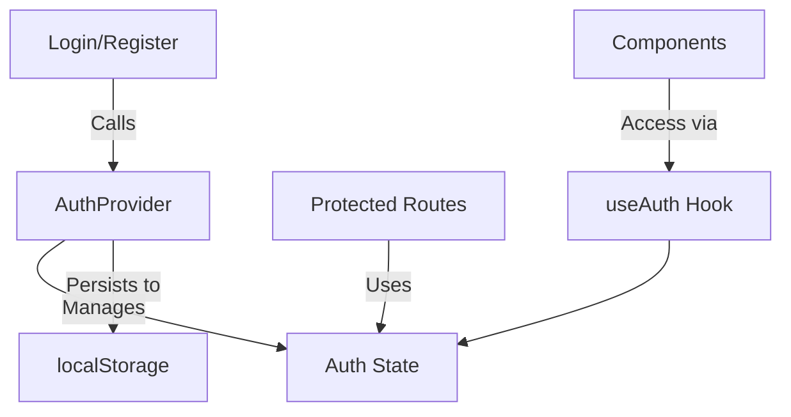

# Authentication System

This document outlines the authentication system implementation for the application, using React Context API with TypeScript.

## Architecture Overview



## Core Components

### 1. Auth Context (`auth-context.tsx`)

Defines the shape of the authentication context and provides a custom hook for easy access.

```typescript
interface AuthContextType {
  token: string | null;
  userId: string | null;
  isAuthenticated: boolean;
  login: (token: string, userId: string) => void;
  logout: () => void;
}

export const AuthContext = createContext<AuthContextType>({...});

export const useAuth = () => useContext(AuthContext);
```

### 2. Auth Provider (`auth-provider.tsx`)

Manages the authentication state and provides it to the application.

Key Features:
- Manages token and user ID state
- Handles login/logout functionality
- Persists auth state to localStorage
- Provides auto-login on page refresh

## Setup

1. **Wrap your application** in `AuthProvider` (in `app/layout.tsx`):

```tsx
<AuthProvider>
  <AppContent />
</AuthProvider>
```

2. **Use in components** with the `useAuth` hook:

```typescript
const { isAuthenticated, login, logout } = useAuth();
```

## Usage Examples

### Login Flow

```typescript
const LoginPage = () => {
  const { login } = useAuth();
  
  const handleSubmit = async (credentials) => {
    const response = await loginUser(credentials);
    login(response.token, response.userId);
  };
};
```

### Protected Routes

Create a protected route component:

```typescript
// components/ProtectedRoute.tsx
export default function ProtectedRoute({ children }) {
  const { isAuthenticated } = useAuth();
  const router = useRouter();

  useEffect(() => {
    if (!isAuthenticated) {
      router.push('/login');
    }
  }, [isAuthenticated, router]);

  return isAuthenticated ? children : null;
}
```

## Best Practices

1. **Token Management**:
   - Store tokens in memory after initial load
   - Use httpOnly cookies for production (more secure than localStorage)

2. **Security**:
   - Implement token refresh logic
   - Handle token expiration
   - Protect API routes with middleware

3. **Performance**:
   - Use `useCallback` for auth functions to prevent unnecessary re-renders
   - Consider using a state management library for larger applications

## Troubleshooting

### Common Issues

1. **Auth State Not Persisting**
   - Check if localStorage is available
   - Verify the token is being saved correctly

2. **Infinite Redirects**
   - Ensure your auth check completes before redirecting
   - Add loading states during auth verification

### Debugging

Add debug logs in `auth-provider.tsx`:

```typescript
useEffect(() => {
  console.log('Auth state changed:', { token, userId });
}, [token, userId]);
```

## Future Improvements

1. Add role-based access control (RBAC)
2. Implement refresh token rotation
3. Add social login integration
4. Implement 2FA support